# Rickshaw Guided Tours Project

## Introduction 
  Welcome to my first milestone project. This project is a website for a fictional guided tours company that uses rickshaw-style bikes and operates in Dublin, Ireland. This website gives the user a way to know the brand and book the service. It also shows the different attractions that are available to see in Dublin.

  A live website can be found [here](https://marcellomuy.github.io/ci-milestone-p1/).

  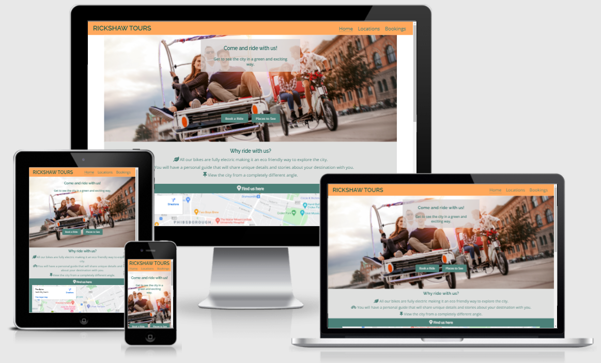

## Table of Contents
[1. User experience (ux) design:](#ux)
  - [User Goals:](#user-goals)
  - [User Expectations:](#user-expectations)
  -	[Color Scheme:](#color-scheme)
  - [Typography:](#typography)
  - [Site skeleton:](#site-skeleton)

[2. Features](#features)

[3.Technologies used](#technologies-used)

[4.Testing](#testing)

[5.Bugs](#bugs)

  
# 1. User experience (UX) design
  [Go to the top](#table-of-contents)

  An online business presence, regardless of industry, can have a massive impact on its success. Nowadays some businesses still don’t realize that a big part of their customer base will visit their website before making a purchase. Having a website increases the credibility of your company and  it is a way to stand out from the others business that might be offering a similar service. 

  
## 1.1 User Goals
  [Go to the top](#table-of-contents)

  The main goal of this website is to increase the brand awareness, give out the contact information and make it easier for the customer to request the service through the bookings page.

  
## 1.2 User Expectations
  [Go to the top](#table-of-contents)

  The following user expections were considered while designing the site:
  * The site structure is designed to be simple and easy to use.
  * The site is designed with a mobile first approach making it easier to read on smaller screens. 
  * The user interface is easy to navigate (including a main navigation bar in the header of the page, buttons in the middle and footer and social links at the bottom of the page).
  * The website is responsive on all device sizes like mobile, tablet and desktop.
  * Screen readers were considered when designing the website
  * All images on the website are of high quality. 
  * To have the ability to contact the company and request the service.

  
## 1.3 Color Scheme
  [Go to the top](#table-of-contents)

  Colors are the first thing people notice when they visit a website, and the color scheme can make a huge impact on both style and consistency.
   
  [ColorSpace](https://mycolor.space/) was used to decide the colors for this design.

  Here is an example of the color scheme that you can find in the website.

  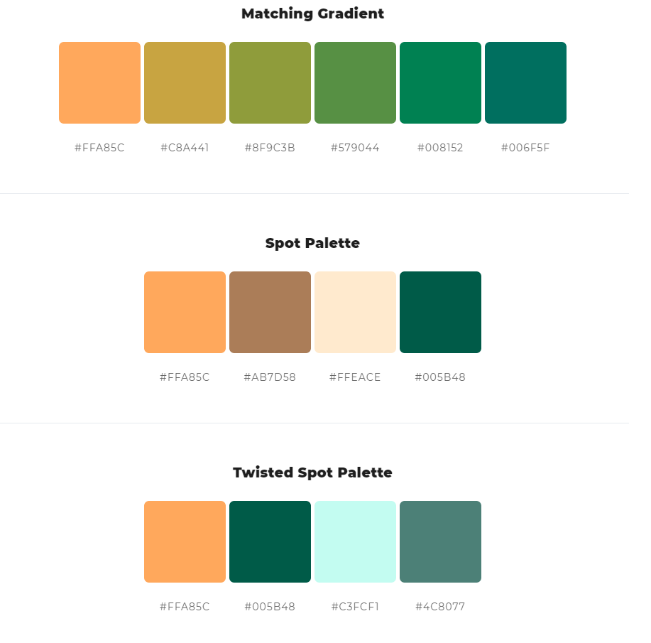 

  The following colors were used to design this website:
  * #4C8077 
  * #005B48
  * #FFA85C
  * #EEEAEA
  * rgba(211, 205, 205, 0.750)
  
  
## 1.4 Typography
  [Go to the top](#table-of-contents)

  Two fonts were used for this design. Open Sans for body elements and Raleway for main headings, Sans Serif was used as backup font in both cases. 
    

  
## 1.5 Site Skeleton
  [Go to the top](#table-of-contents)

  [balsamiq](https://balsamiq.com/) was used to create the wireframes for the website. 

  The mobile version of the wireframes are presented below.

  
### Home Page:
  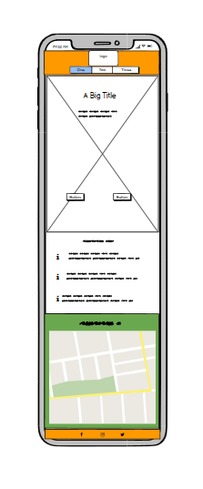

  
### Locations Page:
  

  
### Bookings Page:
  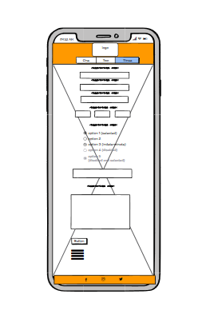

  
# 2. Features
  [Go to the top](#table-of-contents)

## All pages:
  - The navigation bar is placed at the top of the screen with the menu centred on small screens and at the top right on large screens. It has a hover effect and an active CSS class that indicates which page the user is on, improving the user experience.
  - The logo is placed at the top and centred on small screens and top left on large screens. This also works as a link for the home page.
  - Social media links (for Facebook, Twitter, Instagram) are placed in the footer at the bottom of the page. All links will open in a new tab.
  - The color scheme of all pages were chosen using [ColorSpace](https://mycolor.space/) with focus on contrast, consistency and a pleasant user experience.
  - The buttons are consistent on all pages with a hover and border radius effect.
## Home page:
  - Hero image is placed under the navigation bar and is consistent with the website theme.
  - The hero image has a heading and a paragraph that explains the purpose of the website.
  - In large screens there is a box around the heading and paragraph with a background color set to enhance contrast.
  - At the bottom of the hero image there are two buttons that brings the user to the bookings page and locations page respectively.
  - About us section is placed under the hero image with a list of benefits that can be recieved by using the service. A background color and icons were used to improve the appearance and style 
  - Iframe with Google maps location is placed under about us section, it has coloured padding and a heading at the top.
  - Contact Us section is located just above the footer, it has all elements centred and a background color.
  - The home page has a margin on both sides on large screens to improve responsiveness and style.

  The screenshots of the home page are below:

  Home page UI:
  
  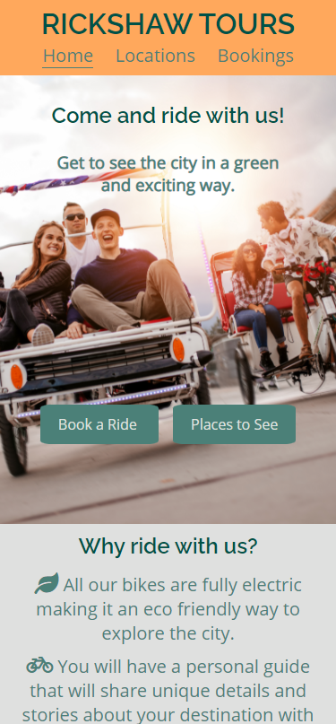
  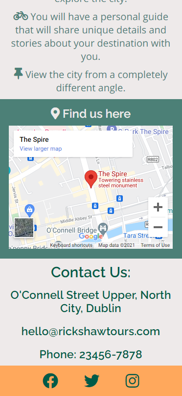 

  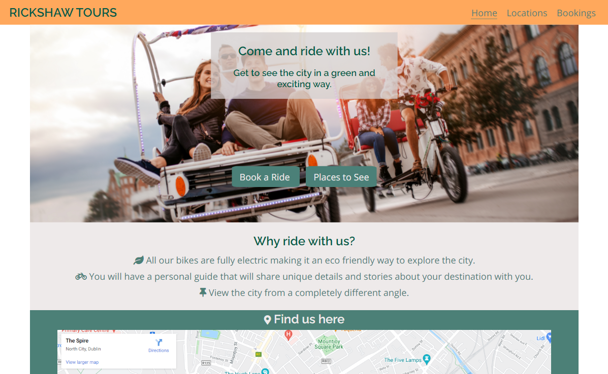

## Locations page:

  - This page has a gallery with pictures of attractions in Dublin. Each image has a heading with the name and a paragraph with a description of the locations.
  - On small screens the content is centred, for large screens the content is floated left and right.
  - Request a new location button at the bottom of the page brings the user to the bookings page.

  The screenshots of the locations page are below:

  Locations page UI:
  
  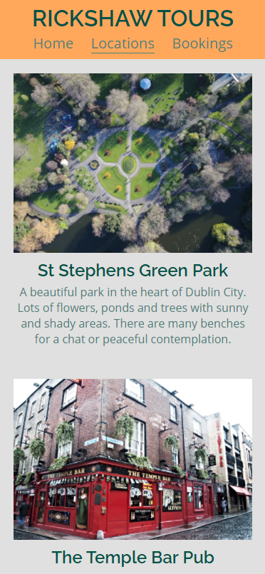 
  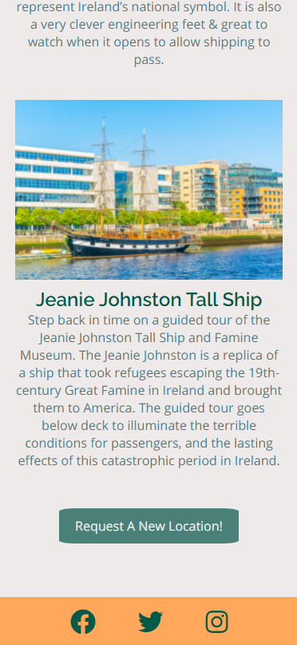

  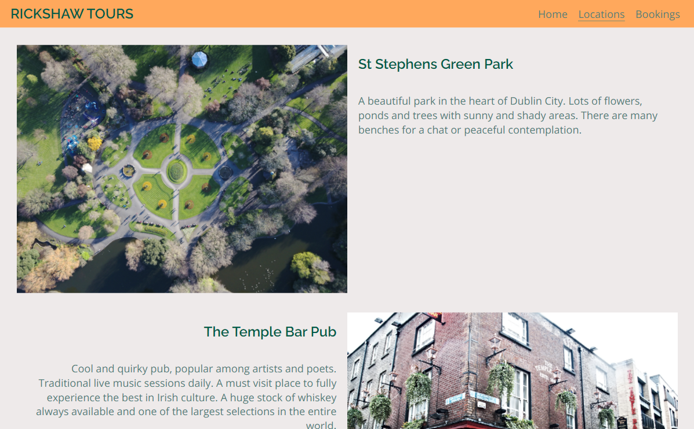

## Bookings page:

  - Background image is consistent with the color scheme and website theme.
  - Includes a contact form that gives the ability to request a booking and ask questions.
  - input type=date for selecting a date.
  - The form uses radio buttons for choosing a location or the option to request a new one.
  - The form uses required attribute for essential information
  - Submit button at the end.
  - The form use the method="POST" action="https://formdump.codeinstitute.net/"

  The screenshots of the bookings page are below:

  Bookings page UI:
  
  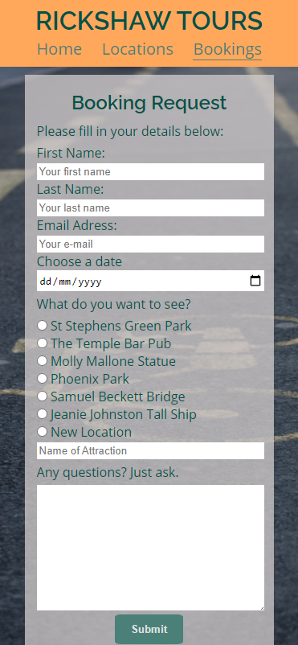 

  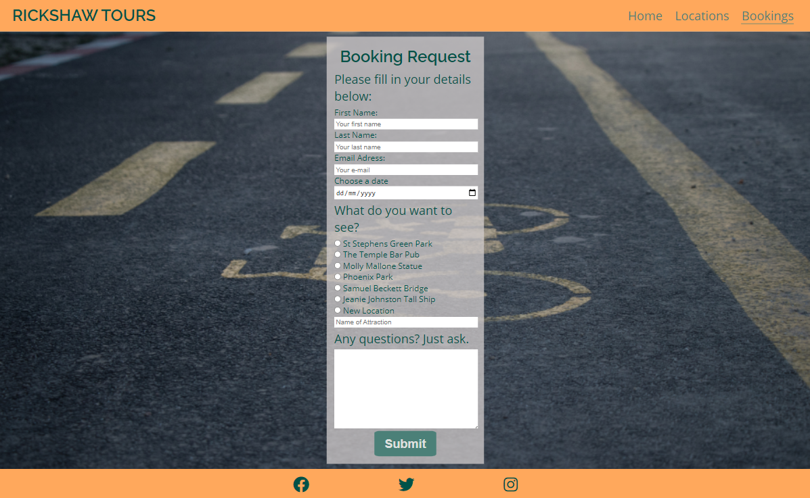

  The feedback form was correctly submitted  as  shown below:

  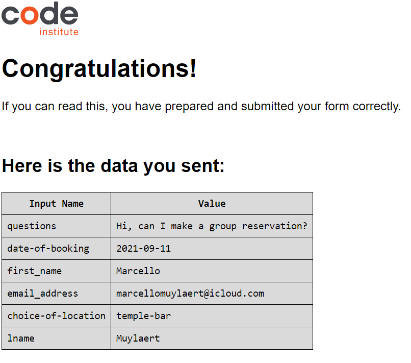

    
# 3. Technologies Used
    [Go to the top](#table-of-contents)

  * [HTML5](https://en.wikipedia.org/wiki/HTML5) (markup language) was used for structuring and presenting content of the website.
 
  * [CSS3](https://en.wikipedia.org/wiki/CSS) (Cascading Style Sheets) was used to style the content written in HTML.

  * [Balsamiq](https://balsamiq.com/) was used to create the wireframes of the website.

  * [Google Fonts](https://fonts.google.com/) was used to import font-family "Raleway" and "Open Sans" into style.css file and which was used throughout the pages of the website.

  * [Font Awesome](https://fontawesome.com/) was used to import icons.

  * [Chrome](https://www.google.com/intl/en_uk/chrome/) was used to debug and test the source code using HTML5 as well as to test site responsiveness.

  * [Github](https://github.com/) was used to create the repository and to store the project's code after pushed from Git.

  * [Gitpod](https://www.gitpod.io/) was used as the Code Editor for the site

  * [ColorSpace](https://mycolor.space/) was used to generate the color scheme of the project.

  * [W3C Markup](https://validator.w3.org/)  was used to validate the HTML code used in the project.

  * [Jigsaw validation](https://jigsaw.w3.org/) was used to validate the CSS style used in the project.

  * [Ami](http://ami.responsivedesign.is/#) was used to generate a screenshot showing responsiveness in different devices. 

  
# 4. Testing
  [Go to the top](#table-of-contents)

## 4.1 Testing With Tools

### Chrome DevTools
  I used the developer tools to debug my code and to try different styles. When something in my code didn’t behave in the way that I expected, I would inspect it and try out different solutions. When I was happy with the results I would then copy and paste the code in the projects file.

### Responsive Tools
  I used [Am I Responsive](http://ami.responsivedesign.is/) in conjunction with Chrome DevTools to check how the website behaved in different screen sizes.

### W3C Validator Tools 

 - I used [W3C Markup](https://validator.w3.org/) to check my code for any errors in the HTML pages.

    I had an error in my index page with a closing section tag that didn’t have an opening tag. I created an opening section tag to fix the error.

    I had an error in my bookings page with an empty section tag that didn’t have any elements inside. The section was deleted to fix the error.

    The screenshots of the validator showing no errors are below:
  
  Home page:

  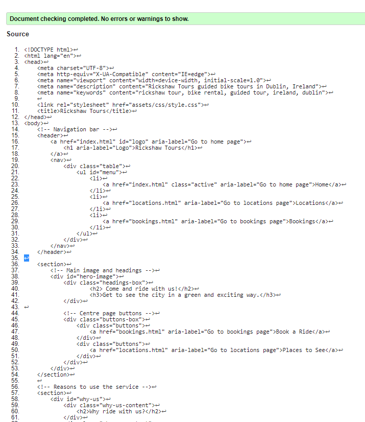 

  Locations page:

  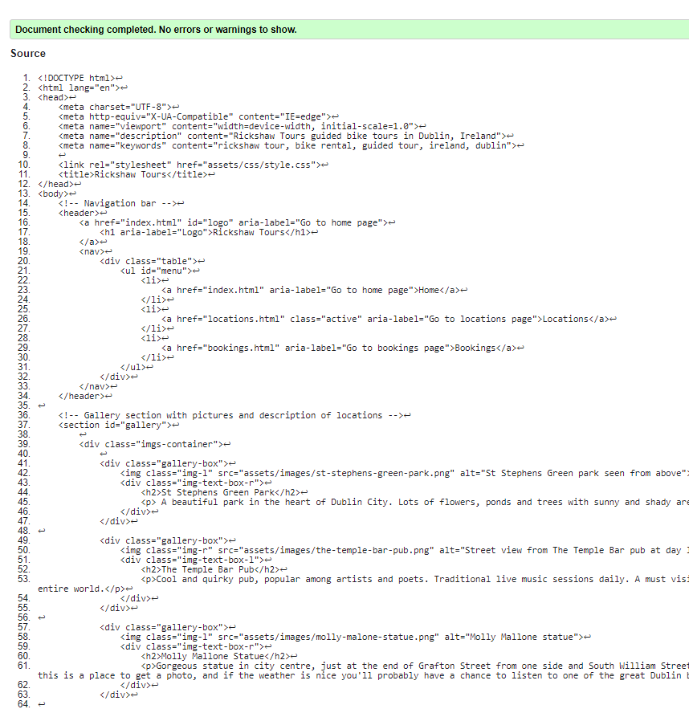
  
  Bookings page:

  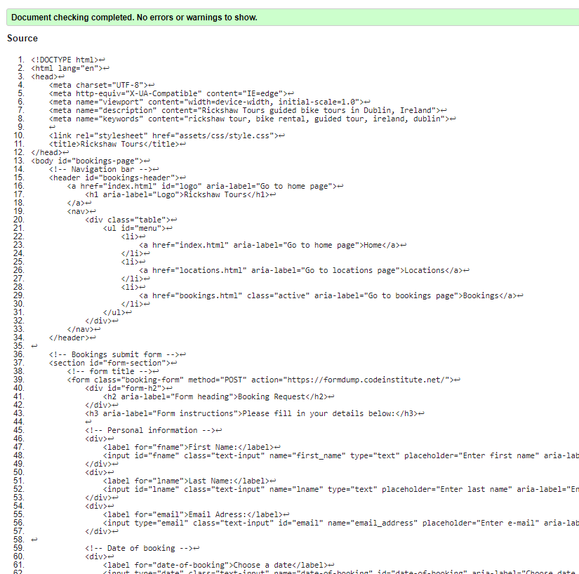

  - I used [Jigsaw validation](https://jigsaw.w3.org/) to check my code for any CSS errors. No errors were found.

  The screenshot of the validator showing no errors is below:
  
  Css style page:

  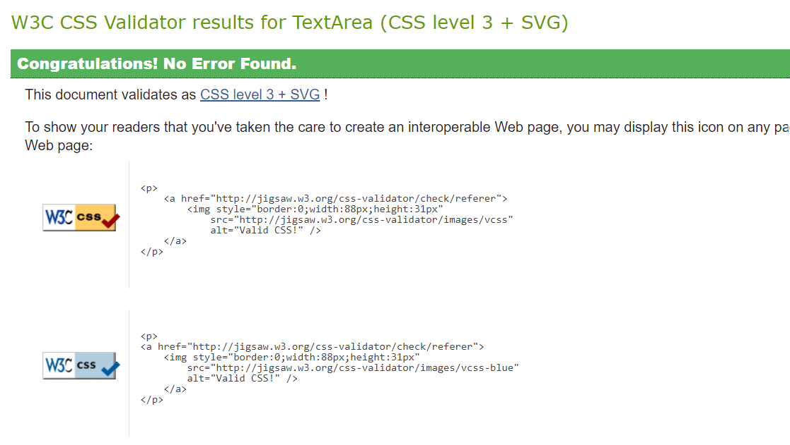 

## Manual Testing 

I have tested my website on Google Chrome and Firefox on multiples devices.
  - iPhone 5/SE (320 x 568)
  - iPhone X (375 x 812)
  - iPad (768 x 1024)
  - iPad Pro (1024 x 1366)
  - Laptop (1280 x 802)
  - Desktop (1600 x 992)

Please find below my testing process for all pages via mobile and web:

## All pages:

### Navigation bar
  - Logo - When clicking the logo, the page is redirected to the home page. Pass.
  - Home - When selected, the page is redirected to the home page, the text is highlighted when hovered and stays like that when in the page. Pass.
  - Locations - When selected, the page is redirected to the Locations page, the text is highlighted when hovered and stays like that when in the page. Pass.
  - Bookings - When selected, the page is redirected to the bookings page, the text is highlighted when hovered and stays like that when in the page. Pass.
  
### Text
  - Check if the fonts were loaded and all text was displayed in the correct size in different screen sizes. Pass

### Responsive
  - All elements were responsive using different break points. Pass.

### Images
  - Check if all images were loaded, weren’t distorted and were responsive for different break points. Pass.

### Buttons
  - Check if all buttons were consistent, with a hover effect and redirected to the right page. Pass.

### Footer
  - Facebook – When clicking the icon, a new tab opens and redirects to the Facebook page. Pass.
  - Twitter - When clicking the icon, a new tab opens and redirects to the Twitter page. Pass.
  - Instagram - When clicking the icon, a new tab opens and redirects to the Instagram page. Pass.
  - Responsive – All elements were responsive using different break points. Pass.

## Bookings page:

### Form
  - Check if the form size was responsive for different screens sizes. Pass.
  - Check the required inputs by trying to submit form with empty fields. Pass.
  - Check if the submit button worked as expected. Pass.

  
# 5. Bugs
  [Go to the top](#table-of-contents)

### Solved Bugs
  - On larger screens hero image headings were difficult to read. Problem fixed by adding a box around then with a background color to improve contrast.
  - On Firefox list icons were displaying text decoration. Problem fixed with using css style text-decoration: none. 
  - Images on locations page were too large on large screens. Problem fixed by adjusting width of images and using property float to accommodate then better on the page.
  - On Firefox form submit button was displaying too close to the textarea tag. Problem fixed by a adding css style padding-top to the button.

  
# 6. Deployment
  [Go to the top](#table-of-contents)

  The project was deployed using Github. The process is described below:

  - Create a new Github repository.
  - Click on settings on the repository page.
  - Click on pages in the Options menu.
  - Go to the source area, select main branch and save.
  - A link for your site project will be generated.
  - Live link for this project [here](https://marcellomuy.github.io/ci-milestone-p1/). 

  
# 7. Credit
  [Go to the top](#table-of-contents)

## Media 
  * All images used in the project came from [Canva](https://canva.com).
  * All icons used in the project came from [Font Awesome](https://fontawesome.com).

## Code 
  * Code to make iframe responsive came from [w3schools](https://www.w3schools.com/howto/howto_css_responsive_iframes.asp).
  * Code for footer was inspired from love running project.
  * For README.md file, https://github.com/iKelvvv/MS1 and https://github.com/dhakal79/Portfolio-project-MS1 was used as reference. 
  * I would like to thank my mentor Marcel Munders who helped me throughout the development of this project.

## Content 
  * Content for locations page came from [Trip advisor](https://www.tripadvisor.ie).

  

 
